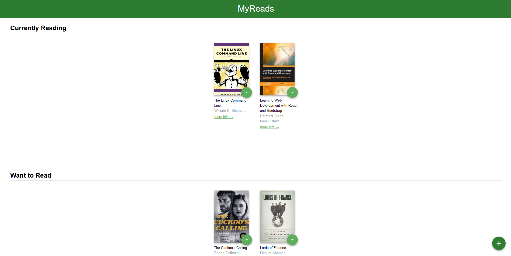

# React My Read Project

## TAble of contents

- [Overview](#overview)
 -[The project](#the-project)
 -[Links](#links)
- [My process](#my-process)
 -[Built with](#built-with)
 -[Notes](#notes)

## Overview

### The project

 create a bookshelf app that allows you to select and categorize books you have read, are currently reading, or want to read.

### Links
 
- Solution URL: https://github.com/ZArrowZ/react-myread-project
- Live Site URL: https://ecstatic-neumann-e4c95c.netlify.app/

## My process

### Built with

- React.js

### Notes

- I replaced state with useState hook.
- I replaced componentdidmount() with useEffect hook. 
